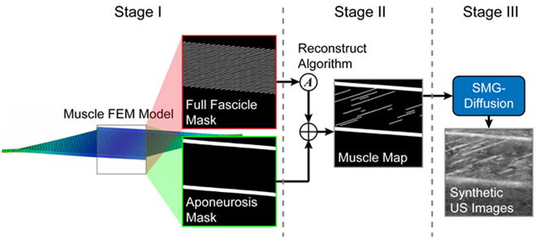

# Synthetic-SMG-Dataset
## from "Synthesizing Real-Time Ultrasound Images of Muscle Based on Biomechanical Simulation and Conditional Diffusion Network"
Multi-task Synthetic SMG Dataset

### Synthesizing pipeline

Our synthesizing pipeline consists of three key stages: (1) real-time muscle deformation simulation, (2) fascicle simulation, and (3) ultrasound image generation. Specifically, in Stage Ⅰ: the muscle FEM model was adopted in the first stage to simulate the real deformation of muscle along with true SMG features. Stage Ⅱ: the full fascicle mask captured from the FEM model was converted to a sparse one according to the real distribution to simulate the partially visible appearance of the fascicle in longitudinal sonogram. Stage Ⅲ: the trained SMG-diffusion would generate high-fidelity ultrasound images based on the structural information in the muscle map.

File naming format: \{Initial pennation angle α\}\_\{Number of sparse fascicles S\}\_\{Initial subcutis thickness ST\}\_\{Step\}\_\{random seed of reconstruction\}

Our synthetic SMG dataset includes Ultrasound images, aponeruosis masks, fascicle masks, and true SMG features.

Ultrasound images, aponeruosis masks, fascicle masks will be available after publication of relevant paper.
